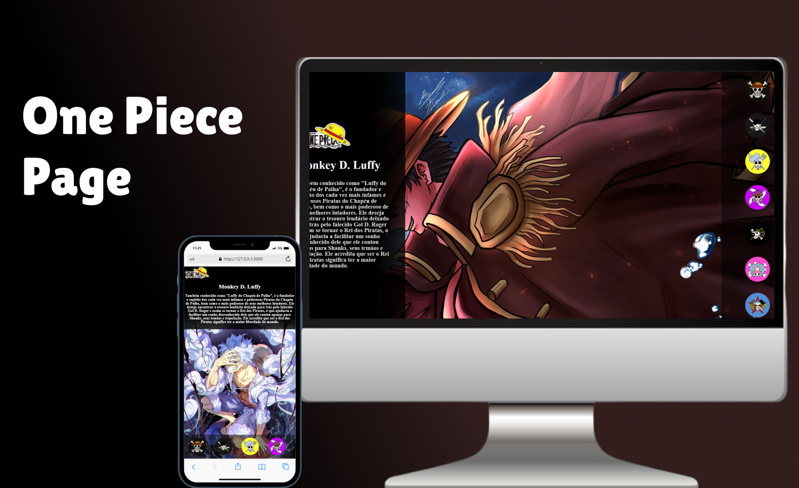

# One Piece Page
 

    

## Tecnologias 

Ess projeto foi desenvolvido com as seguintes tecnologias:

-HTML e CSS  
-JavaScript 
-GitHub e Github Desktop

## Projeto ☻

O One Piece Page é uma nova forma de conhecer mais um pouco sobre os personagens dessa grande obra de sucesso, de maneira atraente e divertida.